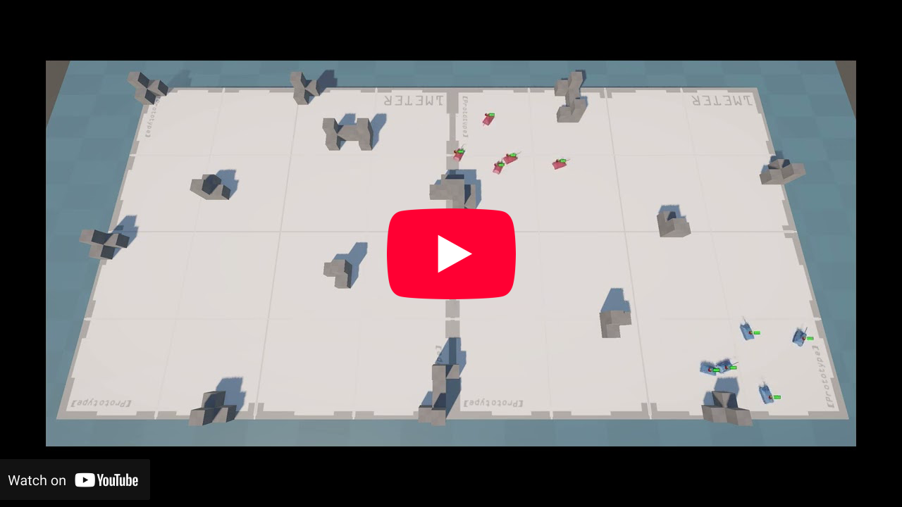
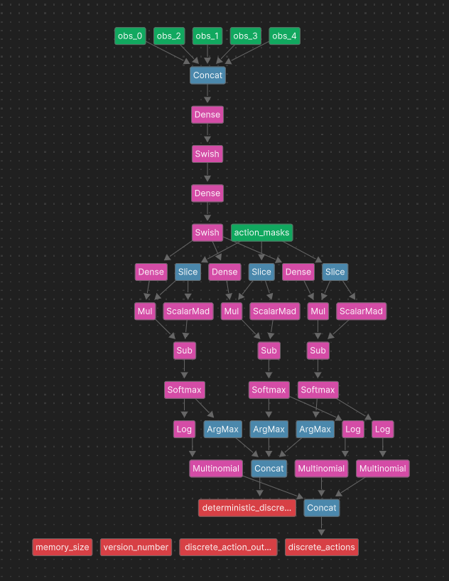
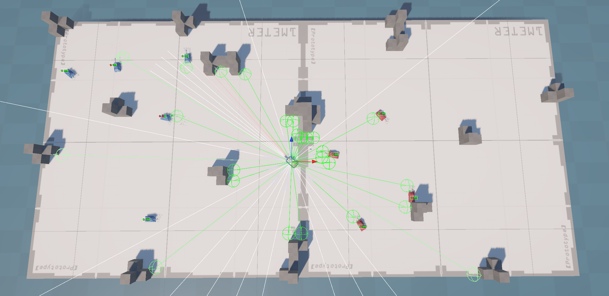
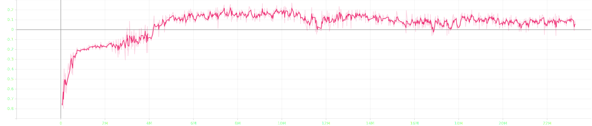
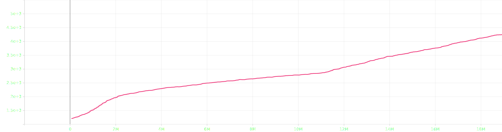

# Project Title

According to the [documentation](https://docs.unity3d.com/Packages/com.unity.ml-agents@4.0/manual/index.html) the Machine Learning Agents (ML-Agents) Toolkit enables games and simulations to serve as environments for training intelligent agents in Unity. Trained agents can be used for many use cases, including controlling NPC behavior (in a variety of settings such as multi-agent and adversarial), automated testing of game builds and evaluating different game design decisions pre-release.

This repository provides an example of a multi-agent, adversarial tank battle environment. Two tank teams fight each other in a battle where the last team of tanks standing wins. The video below shows the battle between two teams of trained tanks (agents) in the example environment.

## Network Architecture

In this example, tanks (agents) must fight against enemy tanks and cooperate with their teammates; therefore, the trainer must be both cooperative multi-agent and adversarial. [MA-POCA (MultiAgent POsthumous Credit Assignment)]( https://docs.unity3d.com/Packages/com.unity.ml-agents@4.0/manual/ML-Agents-Overview.html#training-in-cooperative-multi-agent-environments-with-ma-poca) was chosen as the trainer to be able to train such agents. The network (trainer) has two layers with 512 hidden units. The self-play module is enabled to satisfy the adversarial scenario and teams change every 200k steps. For further details of the network, please refer to the [configuration file](Config/Tank.yaml). The screenshot below visualizes the network architecture.
  

## Training Environment

To achieve more consistent and better results, the training process was divided into five stages. In each stage, the environment became more complex and challenging. Also, the network was initialized with the previous results before starting training in a new environment phase. In other words, training occurred incrementally throughout the phases.
* **Stage 1:** Ground has no holes; there are surrounding walls to prevent falling into the water. Teams have 2 tanks.
* **Stage 2:** Ground has no holes; no surrounding walls. Teams have 2 tanks.
* **Stage 3:** Ground has water holes, no surrounding walls. Teams have 2 tanks.
* **Stage 4:** The same environment with stage 3. Teams have 3 tanks.
* **Stage 5:** Double sized environment with more obstacles and possible spawn points. Teams have 5 tanks.
The screenshot below shows the final environment without tanks.
  

## Actuators and Actions

An agent (tank) has a total of 3 discrete action branches in 2 different actuators.
* **Branch 1:** Move forward, backward or do not move.
* **Branch 2:** Rotate left, right or do not rotate.
* **Branch 3:** Fire or do not fire.
Movement and rotation actions is implemented in the same [actuator](Assets/Scripts/TankMoveActuator.cs) and firing is implemented on [another one](Assets/Scripts/TankFireActuator.cs). Furthermore, motion and rotation have been implemented in different branches to allow the agent to move and turn simultaneously.

## Observations and Sensors

An agent collects observations by using Ray Perception Sensors which implements ray-casting. Each agent has 3 different ray sensors; one to detect the ground to prevent falling into the water, one to collect information about the environment and other tanks and one to accurate aiming. So, agents do not cheat, do not get positions of other tanks (enemy or ally) directly. 

On the other hand, the built-in Ray Perception Sensors can collect limited observations about the environment. The only observations the collect are relative distances with respect to ray length and tags of the casted objects. To overcome this problem and collecting additional observations, a [new sensor](Assets/Scripts/TankSensor.cs) is implemented. This new sensor adds health of the detected tanks in addition to observations of the built-in ray sensor with the stacking feature. This health information encourages tanks to fire at enemies with low health and destroy them instantly.
  

## Rewards and Penalties

Both group and agent rewards are used during the training to achieve better performance.
* **Group Rewards:** The didn’t modified during the training.
    * Win: 1
    * Loss:-1

* **Agent (individual) Rewards:** Some of them were modified during training to achieve better results.
    * Miss shot: -0.001, -0.005 and -0.033, respectively.
    * Friendly fire: -0.3, -0.5 and -1.0, respectively.
    * Hit an enemy without destroying it: 0.1
    * Hit and destroy an enemy: 0.3
    * Get damage: -0.02 and -0.033, respectively.
    * Get destroyed: -0.06 and -0.1, respectively.

## Training Results

Following training results are from the final training stage (the one with the double sized environment).

The image below shows how the cumulative reward changes during the training.
  

The image below shows how the group cumulative reward changes during the training.
  

The image below shows how the self-play ELO score changes during the training.
  

More plots about the training can be found in [training results](Training Results/) folder. Also, please note that agents are trained in a harsh environment with severe penalties, and as a result, the rewards are not as high as expected.

## Test and Heuristic Mode

The environment and agents (tanks) can be tested in the heuristic mode. To test it, select `Assets -> Prefabs -> Tanks -> the Team You Desire -> Behavior Parameters -> Behavior Type -> Heuristic Only`. Now the selected team(s) can be controlled by using **WASD** and **Space** keys in the play mode.
